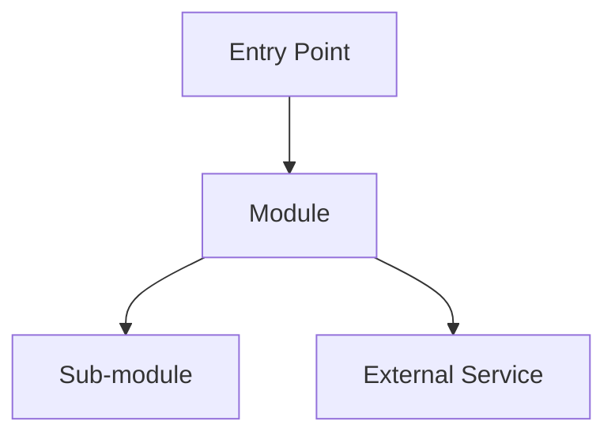
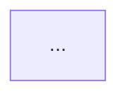

# LCS Improve Architecture

Shared Coding Contract
- Refer to Shared Coding Workflow Contract in `../lcs-shared/contract.md` for folder conventions, Handoff format, and token optimization.

## OKF Frontmatter & Writing Safety

- When creating `architecture-improvement.md`, include YAML frontmatter following the schema in `../lcs-shared/contract.md`.
- Follow the Artifact Writing Safety rules in contract.md — generate content first, write one file, verify, stop on failure.

## Purpose

Map codebase into feature-grouped flowcharts, identify duplicated concerns across features, and propose unified architecture with actionable migration tasks. Produces a structured architecture improvement plan that can be sliced into executable tasks via `lcs-task-slicer`.

## Trigger

Activate when user requests:
- "improve architecture"
- "unify duplicated systems"
- "refactor architecture"
- "find duplication across features"
- "propose unified architecture"
- Before large refactoring efforts to identify consolidation opportunities

Do NOT trigger for:
- New feature implementation (use `lcs-toprd` → `lcs-task-slicer`)
- Single-file refactoring (perform directly)
- Bug fixes (use `lcs-debug` or `lcs-debug-ext`)
- Routine code review (use `lcs-code-review`)

## Workflow Checklist

- [ ] Read `.lcs/state.md` for project context and active work item
- [ ] Prompt user for scope: specific directory, feature list, or "full codebase"
- [ ] Validate scope size (≤50 files; warn if exceeded, prompt confirmation)
- [ ] Scan scope and identify logical features (group by responsibility)
- [ ] Generate per-feature Mermaid flowcharts (`graph TD` syntax)
- [ ] Identify cross-feature duplicated concerns (require ≥2 file citations each)
- [ ] Propose unified architecture diagram (Mermaid `graph TD`)
- [ ] Generate task breakdown for migration (file-specific, actionable)
- [ ] Write `architecture-improvement.md` using template
- [ ] Update `.lcs/state.md` with `current_phase: architecture-planning`

### Phase 1: Scope Discovery

1. Read `.lcs/state.md` to locate active work item.
2. If user specifies a directory or feature list, use that as scope.
3. If user says "full codebase", scan from project root, excluding `node_modules/`, `.git/`, `vendor/`, `__pycache__/`, and build output directories.
4. Count files in scope. If >50, warn with exact file count and ask user to confirm or narrow scope.

### Phase 2: Feature Identification

1. Group source files by logical feature or domain concern (e.g., "authentication", "payments", "notifications").
2. For each feature, list the files that implement it and their primary responsibility.
3. Assign each file to exactly one feature. Files serving multiple features are noted as "shared".
4. Record feature names and file assignments for flowchart generation.

### Phase 3: Flowchart Generation

For each identified feature, produce a Mermaid flowchart using `graph TD` syntax:

````
### Feature: <feature-name>


````

- Include key modules, data flow, and external dependencies.
- Keep diagrams readable: max 15 nodes per flowchart.
- Annotate nodes with file names in parentheses for traceability.

### Phase 4: Duplication Analysis

1. Compare features pairwise for duplicated concerns:
   - Similar data models or schemas
   - Overlapping utility functions
   - Parallel API patterns or middleware
   - Duplicated validation logic
   - Similar error handling patterns
2. Each identified duplication MUST cite ≥2 specific files with line references.
3. Classify each duplication as:
   - **High**: Significant code overlap, high maintenance burden
   - **Medium**: Partial overlap, some shared patterns
   - **Low**: Minor similarity, low priority

### Phase 5: Unified Architecture Proposal

1. Based on duplication analysis, propose a unified architecture that consolidates shared concerns.
2. Generate a single Mermaid `graph TD` diagram showing the proposed structure.
3. For each consolidation, specify:
   - What gets merged or extracted
   - Which files are affected
   - Expected benefit (reduced duplication, clearer boundaries, etc.)
4. Identify new modules or interfaces that would be created.

### Phase 6: Task Breakdown

1. For each proposed consolidation, create an actionable migration task:
   - Which files to modify
   - What to extract or merge
   - How to verify the change (tests to run, behavior to check)
   - Dependencies on other tasks
2. Order tasks by dependency: shared utilities first, then consumers.
3. Assign priority (P0/P1/P2) based on duplication severity.

### Phase 7: Write Report

1. Generate complete `architecture-improvement.md` content including:
   - YAML frontmatter (artifact_type: `analysis`)
   - Executive Summary
   - Current State with per-feature flowcharts
   - Duplicated Concerns table
   - Proposed Architecture diagram
   - Migration Task Breakdown
2. Write to `.lcs/work-items/{timestamp}-{slug-work-item}/architecture-improvement.md`.
3. Update `.lcs/state.md` with `current_phase: architecture-planning`.

## Output Format

Save report as: `.lcs/work-items/{timestamp}-{slug-work-item}/architecture-improvement.md`

Artifact type: `analysis`

### Required Sections

```markdown
---
title: "Architecture Improvement Plan"
format_version: "okf/0.2"
authors:
  - type: agent
    name: "lcs-improve-architecture"
created: "YYYY-MM-DD"
updated: "YYYY-MM-DD"
tags: [architecture, refactoring, duplication]
summary: "Architecture improvement plan for <scope>"
status: draft
related: []
artifact_type: analysis
source: "codebase scan"
cot_level: strict
version: "1.0"
---

# Architecture Improvement Plan

## Executive Summary
<2-3 sentence overview of findings and recommended action>

## Current State

### Feature: <name>
<Mermaid flowchart>

(repeat for each feature)

## Duplicated Concerns

| ID | Severity | Concern | Files Cited | Description |
|---|---|---|---|---|
| DC-001 | High | <concern> | <file1>:<line>, <file2>:<line> | <description> |

## Proposed Architecture



## Migration Task Breakdown

| Task ID | Priority | Description | Files Affected | Dependencies | Verification |
|---|---|---|---|---|---|
| T-001 | P0 | <task> | <files> | None | <test/check> |

## Handoff

Next recommended skill:
Next file to read:
Current phase:
Current confidence:
Blocking questions:
Risks to carry forward:
Source of Truth Bundle:
Must Preserve IDs:
Unresolved IDs:
Suggested next command:
```

## Edge Cases

### Scope >50 files
- Warn with exact file count: "Scope contains {N} files. Recommended maximum is 50 for readable analysis."
- Prompt user: "Proceed with full scope, or narrow to specific features?"
- If user confirms, proceed but note in report that analysis may be less thorough.

### No duplication found
- Output: "No significant duplication detected across the analyzed features."
- Still produce per-feature flowcharts and unified architecture diagram showing current clean separation.
- Handoff to `lcs-domain-modeling` for vocabulary alignment.

### Missing CONTEXT.md
- Infer domain terminology from source code and file structure.
- Note in report: "Domain terminology inferred from codebase; no CONTEXT.md available."
- Recommend `lcs-domain-modeling` to formalize vocabulary.

### Missing .lcs/state.md
- Create a new work item folder with generated timestamp and slug.
- Write initial `state.md` with `current_phase: architecture-planning`.

### Single feature (no duplication possible)
- Produce flowchart and current state analysis only.
- Note: "Single feature analyzed; cross-feature duplication analysis not applicable."
- Recommend `lcs-task-slicer` if refactoring within the feature is desired.

## Handoff

Next recommended skill: lcs-task-slicer (if architecture improvement approved) or lcs-domain-modeling (if vocabulary alignment needed)
Next file to read: architecture-improvement.md
Current phase: architecture-planning
Current confidence: medium
Blocking questions: None
Risks to carry forward: Scope limited to ≤50 files; migration complexity depends on duplication count
Source of Truth Bundle: .lcs/state.md, CONTEXT.md if present, docs/ARCHITECTURE.md if present, analyzed source files
Must Preserve IDs: DC-001, T-001 (concern and task IDs assigned in report)
Unresolved IDs: None
Suggested next command: Slice architecture improvement tasks with lcs-task-slicer

## Chain of Truth Level

Level: Strict

This skill follows the LCS Chain of Truth protocol at the declared level.

### Sources Checked
- `.lcs/state.md` for active work item
- `CONTEXT.md` if present for domain vocabulary
- `docs/ARCHITECTURE.md` if present for existing architecture docs
- Source files within scope (≤50 files)

### Assumptions
- User has identified the scope or agrees to full codebase scan
- Codebase is accessible and files are readable
- Mermaid syntax is valid and renderable

### Plan
1. Phase 1: Scope Discovery — read state, confirm scope, validate size
2. Phase 2: Feature Identification — group files by logical feature
3. Phase 3: Flowchart Generation — produce per-feature Mermaid diagrams
4. Phase 4: Duplication Analysis — compare features, cite files
5. Phase 5: Unified Architecture — propose consolidated structure
6. Phase 6: Task Breakdown — create actionable migration tasks
7. Phase 7: Write Report — output architecture-improvement.md

### Actions Taken
<Per-phase record of what was done>

### Verification
<Confirm file written, state updated, frontmatter valid>

### Report
<Structured summary with confidence rating>
