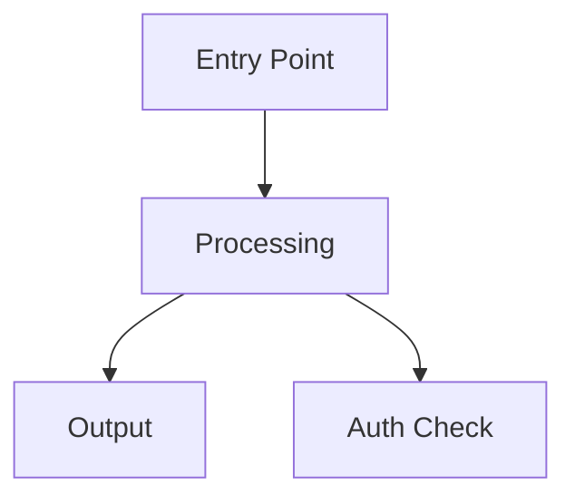
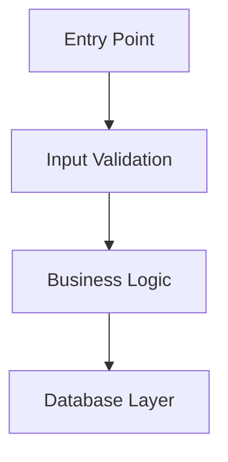
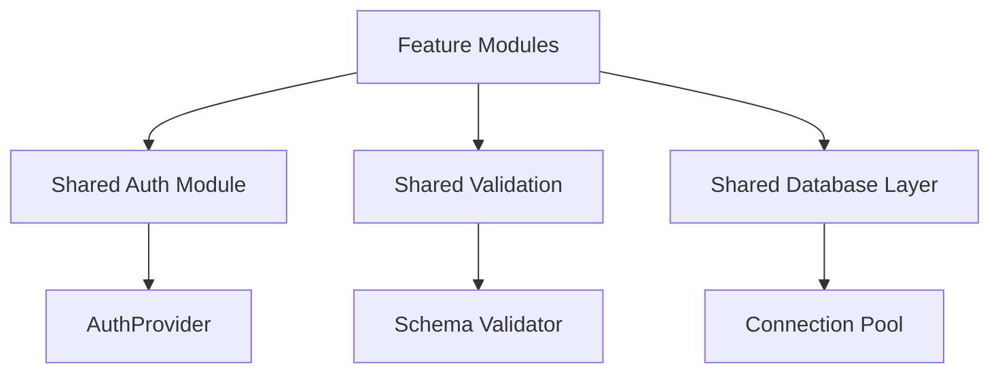

# Architecture Improvement: {Project Name}

## Executive Summary

- **Scope:** {directory/feature list}
- **Analyzed:** {N} files across {M} features
- **Identified:** {K} duplicated concerns
- **Recommendation:** {high-level summary}

## Current State Analysis

### Feature Inventory

| Feature | Entry Point | Key Components | Concerns |
|---------|-------------|----------------|----------|
| {name} | {file} | {list} | {auth, validation, etc.} |

### Per-Feature Flowcharts

#### {Feature A}



#### {Feature B}



## Duplicated Concerns

### CONCERN-001: {Concern Name}

- **Description:** {what is duplicated across features}
- **Affected Files:** {file1.ts:15-30}, {file2.ts:80-95}
- **Impact:** {code duplication, maintenance burden, inconsistency risk}
- **Root Cause:** {lack of abstraction, historical growth, missing shared module}

### CONCERN-002: {Concern Name}

- **Description:** {what is duplicated}
- **Affected Files:** {file3.ts:10-25}, {file4.ts:50-70}
- **Impact:** {code duplication, maintenance burden}
- **Root Cause:** {lack of abstraction, historical growth}

## Proposed Unified Architecture

### Unified Architecture Diagram



### Key Improvements

- **Centralized auth handling** — eliminates {N} duplicate implementations
- **Shared validation module** — reduces code by ~{X} lines
- **Clear boundaries** — features depend on shared modules, not on each other
- **Single source of truth** — configuration and constants extracted to shared

## Migration Task Breakdown

### TASK-001: Extract Shared Auth Module

- **Files:** Create `shared/auth.ts`, modify `featureA/auth.ts`, `featureB/auth.ts`
- **Effort:** 1-2 hours
- **Dependencies:** None
- **Acceptance:** All features use `shared/auth.ts`, existing tests pass unchanged

### TASK-002: Extract Shared Validation

- **Files:** Create `shared/validation.ts`, modify feature validation files
- **Effort:** 1-2 hours
- **Dependencies:** TASK-001 (shared patterns must be identified first)
- **Acceptance:** Validation logic centralized, no behavioral changes

### TASK-003: Refactor Features to Use Shared Modules

- **Files:** All feature files with duplicated concerns
- **Effort:** 2-4 hours
- **Dependencies:** TASK-001, TASK-002
- **Acceptance:** Features import from shared, all tests pass

### /make-plan Prompt

```
Create task plan for architecture migration:
- Extract shared auth module (CONCERN-001)
- Extract shared validation (CONCERN-002)
- Refactor features to use shared modules
- Validate behavior preservation
```

## Chain of Truth Report

### Level

Strict

### Sources Checked

- {list of analyzed source files}
- `CONTEXT.md` if present
- `docs/ARCHITECTURE.md` if present

### Assumptions

- [verified] Scope limited to {N} files
- [verified] Identified {K} concerns with 2+ file citations
- [unverified] Migration effort estimates (conservative)

### Plan Before Action

1. Scan scope for feature boundaries
2. Generate flowcharts per feature
3. Identify duplicated patterns
4. Propose unified architecture
5. Generate task breakdown

### Actions Taken

- Analyzed {N} files
- Generated {M} flowcharts
- Identified {K} duplicated concerns
- Created unified architecture proposal
- Generated {T} migration tasks

### Verification Results

- [x] All Mermaid diagrams syntactically valid
- [x] All concerns cite 2+ files
- [x] Unified architecture addresses all identified concerns
- [x] Task breakdown has file-specific targets

### Risks Identified

- Scope limit (50 files) may miss wider patterns
- Migration effort estimates are conservative
- Behavioral preservation requires thorough testing

## Handoff

- **Next recommended skill:** lcs-task-slicer
- **Next file read:** architecture-improvement.md
- **Current phase:** architecture-planning
- **Current confidence:** {high/medium/low}
- **Blocking questions:** {list or None}
- **Risks to carry forward:** {scope limits, migration complexity}
- **Source of Truth Bundle:** `.lcs/state.md`, `CONTEXT.md` if present, `docs/ARCHITECTURE.md` if present, analyzed source files
- **Must Preserve IDs:** {CONCERN-### IDs, TASK-### IDs}
- **Unresolved IDs:** {list or None}
- **Suggested next command:** Slice architecture improvement tasks with `lcs-task-slicer`
